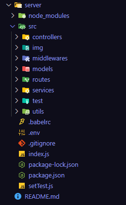

# Quản Lý Thư Viện


## 1. Mô Tả Dự Án

Dự án quản lý thư viện được xây dựng bằng Node.js và Express cho backend, cùng với MongoDB làm cơ sở dữ liệu. Mục tiêu của dự án là cung cấp một hệ thống quản lý sách, quản lý độc giả, quản lí thể loại sách và các thao tác mượn trả sách cho quản trị viên thư viện.

## 2. Tính Năng Chính

- Quản lý thông tin sách
- Quản lý độc giả 
- Quản lí bình luận
- Quản lí thể loại, tác giả 
- Quản lí đặt sách trước
- Hỗ trợ thao tác mượn và trả sách
- Theo dõi lịch sử mượn trả sách
- Đăng nhập và phân quyền cho admin

## 3. Kiến Trúc Hệ Thống


Dự án sử dụng mô hình Model-Controller-Services, bao gồm:

- **Models**: Định nghĩa các schema của MongoDB cho sách, độc giả, và các giao dịch mượn trả sách.
- **Controllers**: Xử lý logic cho các thao tác như thêm sách, mượn sách, trả sách,đăng ký, đăng nhập đọc giả,...
- **Services**: Kết hợp với Controller xử lí logic ngắn ngọn, dễ hiểu, mạch lạc.
- **Routes**: Định tuyến các API cho các chức năng quản lý thư viện.
- **Middlewares**: Xử lí các logic về lỗi trước khi gửi lên server hoặc kết quả lỗi khi xử lí.

   

## 4. Hướng Dẫn Cài Đặt

### Các bước để cài đặt và chạy dự án:

1. Clone repository:
   ```bash
   git clone https://github.com/haidangsondev/Manager_book
   ```
2. Cài đặt các gói cần thiết:
   ```bash
   npm install
   ```
3. Tạo file `.env` và cấu hình các biến môi trường:
- PORT = 7000
- URL_MONGODB = your_url_mongodb
- URL_SERVER = http://localhost:7000
- URL_CLIENT =  http://localhost:3000
- APP_PASSWORD = your_app_password for email 
- EMAIL_NAME = your_email
- JWT_SECRETKEY = your_jwt_secretkey
- CLOUDINARY_NAME = your_cloudinary_name
- CLOUDINARY_KEY = your_cloudinary_key
- CLOUDINARY_SECRET = your_cloudinary_secret

4. Chạy dự án:
- npm run dev
   ```bash
   "dev": "nodemon index.js"
   ```
5. Truy cập hệ thống qua đường dẫn:
   ```
   http://localhost:7000
   ```

## 5. Kết Luận

Dự án quản lý thư viện giúp đơn giản hóa việc quản lý sách và độc giả, tối ưu hóa quá trình mượn trả sách. Trong tương lai, dự án có thể được mở rộng với tính năng quản lý báo cáo, thống kê và tích hợp giao diện người dùng.
